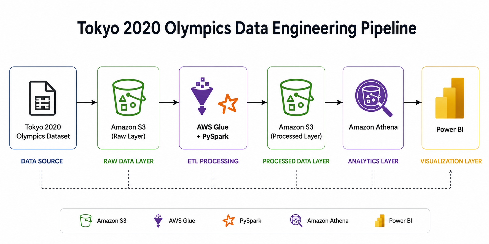

# Tokyo 2020 Olympics Data Engineering Pipeline

An end-to-end cloud data engineering project for processing, transforming, analyzing, and visualizing the **Tokyo 2020 Olympics dataset** using **AWS Glue, Amazon S3, PySpark, Amazon Athena, SQL, and Power BI**.

The project demonstrates a complete data engineering workflow — from raw data ingestion and data-quality processing to cloud-based analytics and business intelligence.

---

## Architecture



---

## Tech Stack

| Category | Technologies |
|---|---|
| Cloud Platform | AWS |
| Object Storage | Amazon S3 |
| ETL | AWS Glue |
| Data Processing | PySpark, Python |
| Query & Analytics | Amazon Athena, SQL |
| Database | Relational Database / SQL |
| Visualization | Power BI |
| Development | Jupyter Notebook |

---

## Key Features

- Built an end-to-end **ETL pipeline using AWS Glue and PySpark**
- Used **Amazon S3** for raw and transformed data storage
- Performed data cleaning and transformation using **PySpark DataFrames**
- Handled missing values, duplicate records, and unnecessary columns
- Generated unique identifiers using regular expressions
- Maintained relationships between athlete and medal datasets
- Corrected inconsistent values to improve overall data quality
- Queried processed datasets using **Amazon Athena and SQL**
- Created analytical visualizations using **Power BI**

---

## ETL Pipeline

### 1. Extract

Raw Tokyo 2020 Olympics datasets are stored in **Amazon S3**.

AWS Glue reads the datasets from the S3 source location and converts Glue DynamicFrames into **PySpark DataFrames** for transformation.

### 2. Transform

The transformation layer performs several data-quality operations:

- Removed records with missing values in critical athlete fields
- Removed unnecessary columns containing large amounts of null data
- Removed duplicate athlete and coach records
- Extracted unique `athlete_id` values using regular expressions
- Extracted unique `coach_id` values using regular expressions
- Generated unique IDs for technical officials
- Created an `athlete_id` relationship between athlete and medal datasets
- Filtered medal records to maintain valid athlete relationships
- Corrected inconsistent gender values in the medals dataset
- Validated transformed datasets before loading

### 3. Load

The cleaned datasets are exported in **CSV format** and written back to Amazon S3.

The transformed data is then made available to **Amazon Athena** for SQL-based analysis and subsequently used for visualization in **Power BI**.

---

## Data Quality & Transformation

A significant part of this project involved preparing inconsistent raw Olympic data for reliable analysis.

Some of the main data-quality improvements included:

- Removed **159 athlete records** where critical attributes such as gender, birth date, or discipline were missing
- Removed columns containing large amounts of missing or unnecessary information
- Removed duplicate athlete and coach records
- Generated `athlete_id`, `coach_id`, and technical-official identifiers from URL fields
- Preserved referential integrity between athlete and medal records using `athlete_id`
- Corrected invalid gender values in medal records using athlete data
- Validated transformed datasets before loading them into the analytical layer

---

## Data Model

The project works with five primary datasets:

| Dataset | Purpose |
|---|---|
| Athletes | Athlete information including country, gender, discipline, and birth date |
| Coaches | Coach information including discipline, function, and country |
| Medals | Individual medal records linked to athletes |
| Medals Total | Country-level gold, silver, bronze, and total medal counts |
| Technical Officials | Officials participating across Olympic disciplines |

The athlete dataset uses `athlete_id` as a unique identifier, while medal records use `athlete_id` to maintain a relationship with athlete information.

---

## Data Analysis

The transformed datasets are queried using **Amazon Athena**.

Example analytical questions explored in the project include:

- How many athletes participated in each discipline?
- Who was the oldest athlete in the dataset?
- Which coaches were born within a specified date range?
- What was the average coach age by discipline?
- How were medals distributed by gender?
- Which technical officials shared the same birth date?

These queries demonstrate how the transformed data can be used for analytical exploration after the ETL process.

---

## Data Visualization

**Power BI** was used to create visualizations from the processed Olympic data.

The analysis includes:

- Athlete distribution by gender
- Disciplines with the highest number of coaches
- Coach distribution by function
- Medal distribution by gender
- Technical officials by function

Detailed visualization outputs are available in the [`docs`](./docs) directory.

---

## Project Structure

```text
tokyo-2020-olympics-data-pipeline/
│
├── notebooks/
│   ├── olympics-etl-pipeline.ipynb
│   └── spark-data-cleaning.ipynb
│
├── sql/
│   └── olympics-analysis-queries.sql
│
├── docs/
│   ├── data-analysis.pdf
│   └── data-visualization.pdf
│
└── README.md
```

---

## Engineering Challenges

### Handling Data Quality Issues

The raw datasets contained missing values, duplicate records, unnecessary columns, and inconsistent values.

These issues required evaluating which records and attributes were important for downstream analysis rather than simply removing every incomplete record.

### Maintaining Dataset Relationships

Cleaning the athlete dataset meant that some athlete records were removed. Medal records therefore needed to be validated against the cleaned athlete dataset to prevent invalid athlete relationships.

### Standardizing Identifiers

Several datasets contained identifiers embedded within URL fields. Regular expressions were used to extract these values and create identifiers such as `athlete_id` and `coach_id`.

---

## Repository Contents

- **`notebooks/`** — PySpark data-cleaning and ETL notebooks
- **`sql/`** — SQL queries used for analytical exploration
- **`docs/`** — Supporting analysis and visualization documentation
- **`README.md`** — Project architecture, implementation, and technical overview

---

## Future Improvements

Potential improvements to the pipeline include:

- Convert notebook-based ETL logic into modular Python scripts
- Introduce automated data-quality validation
- Store transformed analytical data in **Parquet** instead of CSV
- Partition S3 datasets for more efficient Athena queries
- Add orchestration and scheduling for automated pipeline execution
- Implement infrastructure as code for AWS resources
- Add automated testing and CI/CD
- Improve dashboard presentation and publish selected visualizations directly in this README

---

## Dataset

The project uses the **Tokyo 2020 Olympics dataset** from Kaggle.

The dataset contains information about athletes, coaches, medals, countries, disciplines, and technical officials.

---

## Author

**Srijan Nirmal Kumar Galla**

Data Engineering Project — Tokyo 2020 Olympics
